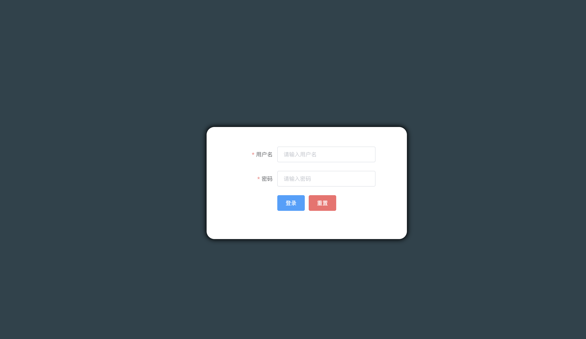

<!--
 * @Description: 
 * @Author: Moriaty
 * @Date: 2019-08-14 16:04:40
 * @Last modified by: Moriaty
 * @LastEditTime: 2020-08-03 12:16:12
-->
# 项目简介

本项目是基于Vue、Element-UI的后台管理

## 一、目录结构

```
├── README.md
├── babel.config.js
├── package-lock.json
├── package.json
├── node_modules
├── public
│   ├── favicon.ico
│   └── index.html
└── src
    ├── App.vue
    ├── assets
    │   └── logo.png
    ├── components
    │   ├── Aside.vue //侧边栏导航
    │   └── Header.vue // 头部
    ├── main.js
    ├── pages // 每个页面
    │   ├── AccountList.vue // 会员列表
    │   ├── Admin.vue // 后台首页
    │   ├── CategoryList.vue // 分类列表
    │   ├── GoodsAdd.vue // 添加商品
    │   ├── GoodsEdit.vue // 编辑商品
    │   ├── GoodsList.vue // 商品列表
    │   ├── Login.vue // 登录页面
    │   └── OrderList.vue // 订单页面
    └── store
        └── index.js 
```

## 二、快速安装

### 1、clone到本地

前端：`git clone git@github.com:baozouai/shop-admin.git`
后端：`git clone git@github.com:baozouai/shop-admin-backend.git`
### 2、打开终端，在项目根目录运行以下命令

前端以及后端：`npm install`

### 3、然后前端运行`npm run serve`，后端运行`nodemon app.js`开启项目

项目默认运行在`http://localhost:8080/`，可自行修改端口

### 4、成功如图



其他请看[项目截图](./项目截图)